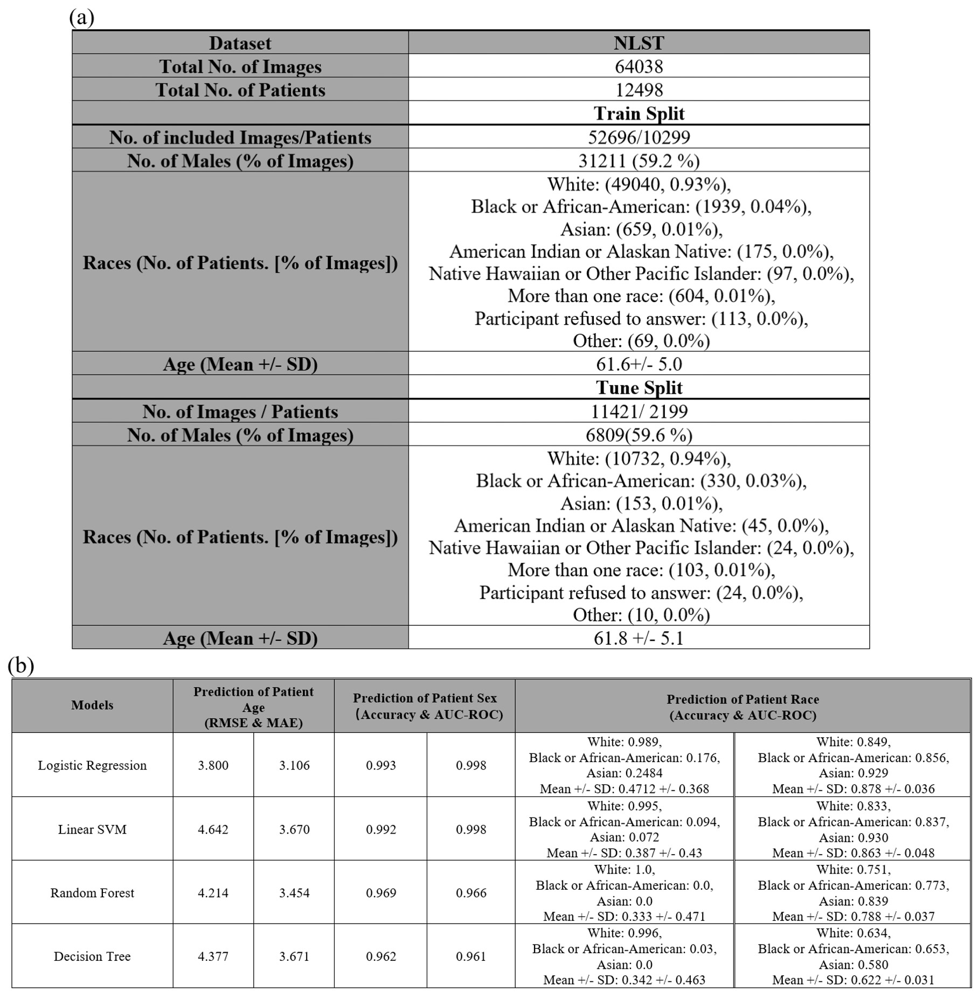
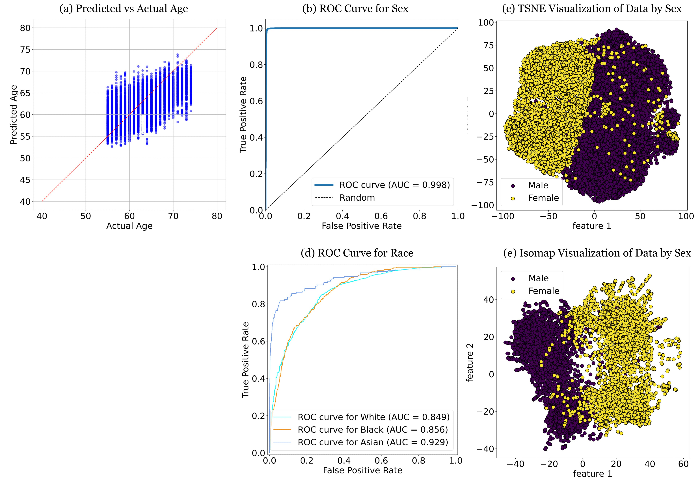

# Demographic Predictability in 3D CT Foundation Embeddings

This repository contains the code and resources for the study conducted on the demographic predictability of CT Foundation Tool's embeddings (https://research.google/blog/taking-medical-imaging-embeddings-3d/) of the NLST dataset (https://cdas.cancer.gov/nlst/). The research is motivated by the potential implications of using these embeddings in clinical decision support systems.

## Introduction

Self-supervised learning has brought significant advancements in medical imaging, particularly in extracting features from large-scale unlabeled datasets. This project explores the potential of self-supervised methods applied to 3D computed tomography (CT) data, focusing on how well these embeddings capture demographic traits. 

Key findings of our study include:
- Self-supervised CT embeddings can predict certain demographic features (e.g., sex and age) with excellent performance
- The implications of these embeddings on personalized clinical applications and the potential implications related to encoding demographic information.

## Materials and Methods

### Dataset

We utilized the National Lung Screening Trial (NLST) public dataset, which comprises 3D CT images of patients aged 55 to 74 along with their demographic information (age, sex, and race). The train-tuning split is provided by the CT Foundation Tool.

- **Training Dataset**: 10299 patients (52696 images)
- **Tuning Dataset**: 2199 patients (11421 images)

The embeddings are precomputed by the CT Foundation Tool (https://colab.research.google.com/github/Google-Health/imaging-research/blob/master/ct-foundation/CT_Foundation_Demo.ipynb)

### Models and Evaluation

Various conventional classifiers and regression models were trained on the embeddings:

- Logistic Regression (simulated with a 1-layer MLP)
- Linear Support Vector Machine
- Random Forest
- Decision Tree

Performance metrics included:
- **Regression**: Root Mean Square Error (RMSE), Mean Absolute Error (MAE)
- **Classification**: Class-wise accuracy, Area Under the Curve (AUC) of Receiver Operating Characteristic (ROC)

Statistical significance was defined at \( p < 0.05 \).

### Table of Results

*Table 1: Detailed statistics of the NLST dataset and model performance on patient demographics.*

### Figure of Results

*(a) Logistic regression models predicted age vs. actual age compared. (b) ROC curve of the logistic regression model classification for sex. (c) T-SNE Visualization of the data colored by sex. (d) ROC curve of the logistic regression model classification for race. (e) Isomap visualization of the data colored by sex.

## Results

The study focused on understanding the accuracy of linear models in predicting demographic information based on CT Foundation embeddings. The results indicated that the embeddings successfully captured demographic traits such as age and sex but could not capture race as well. These demographic encoding could influence their application in clinical settings.

## Acknowledgments

We acknowledge the contributions of our collaborators and the funding sources that supported this research.

## Contact

For more information and inquiries, please contact:
- guangyaoz
 
Feel free to explore the code, provide feedback, or contribute to this ongoing research!
